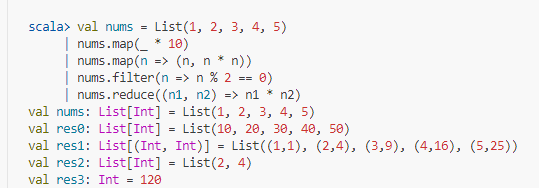
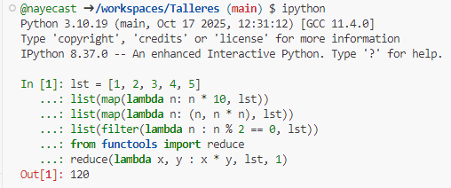

# Taller Individual Nro. 1
## Primeros pasos en programación funcional

**Semana**: 1

**Objetivos**:

- Conocer las herramientas que utilizará en la asignatura: GitHub Codespaces, SDKMAN, Scala-CLI
- Familiarizarse con cada una de las herramientas, especialmente el entorno Codespaces.
- Crear su primer programa funcional.

### Descripción:

#### Primera parte:

Usar Codespaces para instalar algunas herramientas adicionales, tales como Java 25, SBT (Scala Building Tool) y Scala-CLI.

Para el proceso de instalación utilizará la herramienta denominada SDKMAN que ya se encuentra instalada en nuestro entorno Codespaces. Lo primero que debe hacer es utilizar el terminal para ejecutar el siguiente comando:
```shell
sdk list java
```

Navegar por la tabla resultante hasta que en la columna **Vendor** aparezca el texto **Java.net**, en la columna **Version** buscar la opción **25**, seleccionar y copiar el texto de la columna **Identifier** que debe ser `25-open`. Para salir de la tabla presione la tecla **q**.

Con el texto copiado ejecutar el comando:
```shell
sdk install java 25-open
```

De manera similar navegar e instalar las últimas versiones de las herramientas sbt y Scala CLI. Los identificadores que usa SDK son **sbt** y **scalacli** respectivamente. Aquí las tablas son más sencillas ya que no existen diferentes proveedores y únicamente se mostrará la lista de versiones. No olvide usar la letra q para salir de las listas.

Una vez que concluya con todas las instalaciones deberá llamar a su docente para verificar la correcta instalación de las mismas.

#### Segunda parte:

Son muchos los lenguajes de programación que actualmente soportan el paradigma de programación funcional, muchos de ellos, no son 100% funcionales, pero, implementan los conceptos principales. Entre los lenguajes que se usará en esta asignatura se encuentran:

- Scala 3
- Java 25
- Python 3

El orden del listado anterior muestra la frecuencia de uso de cada lenguaje. Scala se usará en la parte docente, para explicar los conceptos de la programación funcional. Java y Python serán utilizados en la parte práctica. Recuerde, la idea principal de la asignatura es que usted aprenda acerca de programación funcional y no convertirlo en experto en un lenguaje de programación.

Es momento de pasar a la práctica. Realice las siguientes actividades:

- Abrir tres ventanas del terminal
- Ejecutar las herramientas REPL de los lenguajes de programación Java, Scala y Python, para conseguir esto debe ejecutar:
	- En la primera ventana ejecutará el comando: **jshell**
	- En la segunda ejecutar: **scala**
	- En la tercera ejecutará **ipython**

En cada una de las ventanas ejecutará los siguientes comandos:

**Para Java (jshell)**
```java
var nums = List.of(1, 2, 3, 4, 5);
nums.stream().map(n -> n * 10).toList()
record Tuple(int x, int y){}
nums.stream().map(n -> new Tuple(n, n * n)).toList()
nums.stream().filter(n -> n % 2 == 0).toList()
nums.stream().reduce(1, (n1, n2) -> n1 * n2)
```


**En Scala (scala)**
```scala
val nums = List(1, 2, 3, 4, 5)
nums.map(_ * 10)                                                                              
nums.map(n => (n, n * n))
nums.filter(n => n % 2 == 0)
nums.reduce((n1, n2) => n1 * n2)
```


**En Python (ipython)**
```python
lst = [1, 2, 3, 4, 5]
list(map(lambda n: n * 10, lst))
list(map(lambda n: (n, n * n), lst))
list(filter(lambda n : n % 2 == 0, lst))
from functools import reduce
reduce(lambda x, y : x * y, lst, 1)
```



Las sentencias anteriores en cualquier lenguaje hacen lo siguiente:

1. Declarar e inicializar una lista de números enteros
2. **Mapear**: crear una nueva lista en donde cada elemento es fruto de la multiplicación por 10 de los elementos de lista anterior.
3. **Mapear**: crear una nueva lista en donde cada elemento es una *tupla* que se genera con el elemento de la lista original y su cuadrado.
4. **Filtrar** los números que son pares
5. **Reducir**: calcular el producto de los elementos que se encuentran en la lista.

Note cómo en cada uno de los lenguajes utilizan formas diferentes para trabajar con expresiones o también conocidos como funciones lambda, así: Java usa `->`, Scala emplea `=>` y Python la palabra `lambda`. Observe también cómo Scala y Python tienen una estructura de datos denominada tupla, mientras que en Java se debe utilizar un tipo de clase denominado record.

Luego de revisar los programas **¿cuál de ellos tiene una sintaxis más fácil de comprender?**

La sintaxis que es mas facil para mi es python ya que esto es porque tiene una estructura s muy simple, directa que es mas facil de comprender

Antes de finalizar con la actividad planificada, es momento de proponer un ejercicio que tiene dos partes.

La primera, transformar el siguiente código Java a Scala (use el texto de [Scala 3, una breve iniciación](https://github.com/jorgaf/scala-3-intro/wiki/Scala-3,-una-breve-iniciación))
```java
double getAverage(List<Integer> nums) {
	var sum = 0;
	for(var num : nums) {
		sum += num;
	}
	return sum / (double)nums.size();
}
```
```scala
def getAverage(nums: List[Int]): Double = {
  val sum = nums.sum
  sum.toDouble / nums.size
}
```
La segunda, pídale a ChatGPT que transforme el código anterior, escrito de forma imperativa, a una versión en donde se utilice el paradigma de programación funcional, para los lenguajes de programación: Haskell, Python y Scala 3. Le sugiero incluir en el prompt el código Java anterior. Implemente el código que obtuvo utilizando la herramienta **Scala CLI**. A través del comando:
```shell
scala-cli repl
```
Scala
```scala
def getAverage(nums: List[Int]): Double =
  nums.foldLeft(0)(_ + _).toDouble / nums.size

```
Haskell
```haskell
getAverage :: [Int] -> Double
getAverage nums = fromIntegral (sum nums) / fromIntegral (length nums)

```
Python
```python
from functools import reduce

def get_average(nums):
    return reduce(lambda acc, x: acc + x, nums, 0) / len(nums)

```
Esta segunda parte finaliza cuando muestre a su docente todo lo implementado.

### Calificación:

Tal como se le explicó anteriormente, los talleres se calificarán de la siguiente manera:

- 10 puntos si presenta en el horario de prácticas y experimentación.
- 7 puntos si presenta en el horario de tutoría.